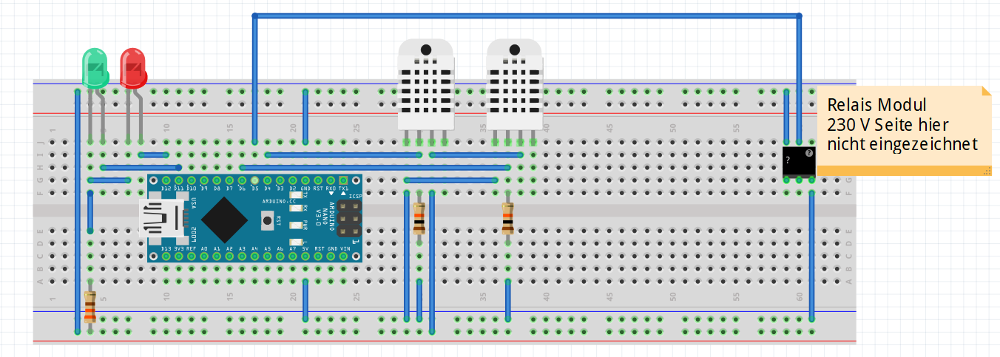

Dies ist meine vereinfachte Version vom Taupunktlüfter der Maker Media GmbH.
Das Original mit den wichtigsten Fragen rund um den Taupunktlüfter beantwortet eine **[FAQ](https://heise.de/-6526328)**. Die vollständigen Artikel zum Projekt gibt es in der **[Make-Ausgabe 1/22 ab Seite 22](https://www.heise.de/select/make/2022/1/2135511212557842576)** und in der **[Make-Ausgabe 2/22 ab Seite 82](https://www.heise.de/select/make/2022/2/2204711461516715363)** zu lesen.

Das Original Github Projekt liegt hier: https://github.com/MakeMagazinDE/Taupunktluefter

# Taupunktlüfter

**Der Zweig vom Original ist bewusst absolut einfach gehalten. Er besitzt nur noch eine vereinfachte Anzeige mit 2 LEDs. Rot für Fehler und grün für ordnungsgemäßen Betrieb. **

Der Code befindet sich im Verzeichnis TaupunktLueftungEinfach

Teileliste:
- 2 x Widerstand 10 kOhm
- 1 x Widerstand 330 Ohm
- 2 x DHT22
- 1 x Leuchtdiode rot
- 1 x Leuchtdiode grün
- 1 x Arduino Nano oder Arduino Uno etc.
- 1 x Relaismodul mit 5V Ansteuerung
- 1 x Lüfter 230 V

Im Programm werden die Bibliotheken DHT sensor library von Adafruit und Sodaq_wdt verwendet.